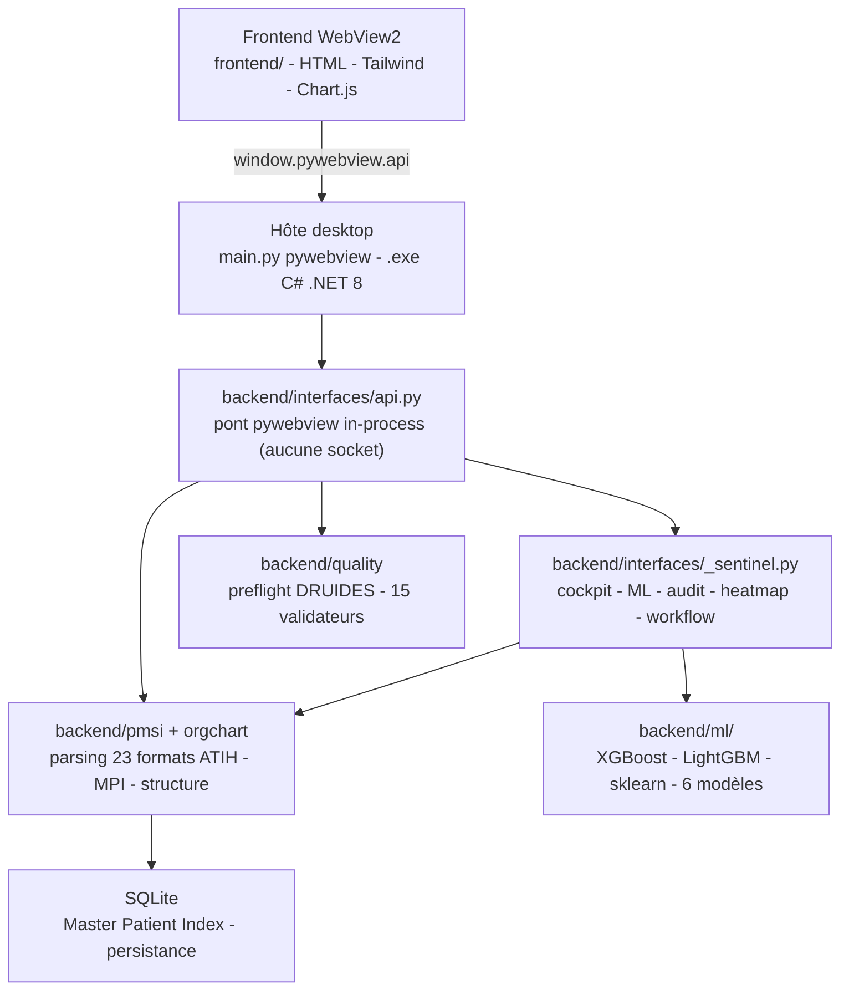

    

# Sovereign OS DIM - Station PMSI

<!-- adam-badges:start -->
[](https://github.com/Adam-Blf/sovereign_os_dim/commits) [](https://hits.sh/github.com/Adam-Blf/sovereign_os_dim/) [](https://github.com/Adam-Blf/sovereign_os_dim/commits) [](https://github.com/Adam-Blf/sovereign_os_dim) [](LICENSE)
<!-- adam-badges:end -->


[](https://github.com/Adam-Blf/sovereign_os_dim/actions/workflows/test.yml)


Application desktop pour la station DIM du **GHT Psy Sud Paris** (Fondation Vallée
+ Paul Guiraud, FINESS 940140049). Traite les fichiers ATIH PMSI, résout les
collisions d'identito-vigilance, produit les exports e-PMSI. **100 % local,
RGPD-safe, aucune donnée patient n'est transmise.**

> **Noms et design provisoires.** Les noms de modules, l'identité visuelle et
> l'ergonomie présentés dans ce dépôt sont provisoires. Ils pourront évoluer selon
> les demandes de la Direction des Ressources Numériques (DSN/DSI) du GHT Psy Sud
> Paris, dans le cadre de la mise en conformité avec le système d'information et les
> exigences de sécurité informatique de l'établissement. La DSN est associée à la
> conception ; toute orientation fonctionnelle, tout nom ou tout choix graphique peut
> être ajusté ou renommé sur sa recommandation.

## Architecture



## Fonctionnalités

- **23 formats ATIH** - PSY (RPS, RAA, RPSA, R3A, EDGAR, FICHSUP-PSY…), MCO (RSS, RSFA, RSFB, RSFC), SSR/SMR (RHS, SSRHA, RAPSS), HAD (RPSS, RAPSS-HAD), transversal (VID-HOSP, ANO-HOSP).
- **Master Patient Index** - croisement IPP/DDN, persistance SQLite, reprise batch interrompu.
- **Identitovigilance** - détection collisions, résolution automatique par fréquence majoritaire ou manuelle.
- **Preflight DRUIDES** - 15 validateurs avant upload e-PMSI - FINESS, IPP, DDN, CIM-10, mode légal, secteur ARS, chaînage, duplicatas, orphelins.
- **CimSuggester IA** - suggestion de code CIM-10 quand le DP est absent - modèle local (TF-IDF + régression logistique) par défaut, zéro configuration ; un serveur Ollama intranet peut le remplacer via `OLLAMA_BASE`.
- **Module ML** *(V36-V37.3)* - 6 modèles entraînés sur dataset synthétique, tous locaux : format_detector (58 classes, acc 0.77), collision_risk (AUC 1.0), ddn_validity (AUC 0.86) *(V36, XGBoost/LightGBM)* ; cim_suggester *(TF-IDF + régression logistique)* ; prédicteur de durée de séjour *(XGBoost, MAE 11.1 j, R² 0.404 sur 20 000 séjours synthétiques)* ; regroupement de patients *(KMeans + UMAP)* *(V37.3)*. Benchmark 4 algos par tâche sur les modèles V36 (XGB default + tuned, LightGBM, RF), garde le meilleur. Voir `backend/ml/`.
- **Structure polaire** - arborescence Pôle/Secteur/UM avec organigramme vectoriel + export PDF multi-pages.
- **Analyse d'activité par UM** *(V35)* - drop-zone HTML5 accessible clavier, parsing RPS/RAA asynchrone en chunks 5000 lignes, détection des UM dormantes, export CSV UTF-8 BOM, badges rouges clignotants sur l'arbre.
- **Dashboard Live** - 4 graphiques Chart.js + 6 KPI dérivés du MPI, export PDF paysage.
- **Inspector Terminal** - décomposition ligne par ligne avec 15 validations, pseudonymisation auto.
- **100% local, zéro réseau** - aucun serveur HTTP, aucune socket en écoute. Le frontend appelle Python via le pont in-process de pywebview (`window.pywebview.api`). Aucune surface de fuite de données.
- **Moulinette FICHCOMP** *(V37)* - moulinette Excel vers fichier plat FICHCOMP/FICHDMI à largeur fixe (suppléments transports, médicaments, dispositifs médicaux). Nettoyage du classeur source, propagation des dates, génération du format ATIH puis contrôle de longueur (53 caractères médicament, 50 caractères DMI). Code source dans `tools/moulinette_fichcomp/`.
- **Export PDF** - organigrammes, rapports preflight, dashboards BIQuery (HTML→PDF).
- **Guides PDF** *(V37)* - `docs/Sovereign_OS_DIM_Guide.pdf` (38 pages, polices Unicode, orientation métier, page Roadmap, références ATIH/ARS vérifiées).

## Formats ATIH supportés

| Champ | Formats | Depuis |
|-------|---------|--------|
| **PSY** | RPS, RAA, RPSA, R3A, FICHSUP-PSY, EDGAR, FICUM-PSY, RSF-ACE-PSY | 2007 |
| **MCO** | RSS/RUM, RSFA, RSFB, RSFC | 1991 |
| **SSR/SMR** | RHS, SSRHA, RAPSS, FICHCOMP-SMR | 2003 |
| **HAD** | RPSS, RAPSS-HAD, FICHCOMP-HAD, SSRHA-HAD | 2005 |
| **Transversal** | VID-HOSP, ANO-HOSP, FICHCOMP | 2009 |

## Installation

### Version portable (recommandée)

Double-cliquez sur `Sovereign_OS_DIM_Portable.exe` (généré par `python build.py`,
voir ci-dessous). Aucune installation, aucun droit administrateur requis.

### Version code source

```bash
git clone https://github.com/Adam-Blf/sovereign_os_dim.git
cd sovereign_os_dim
python -m venv .venv
.venv/Scripts/activate
pip install -r requirements.txt
python main.py
```

### Build d'un exe portable

```bash
python build.py
```

Produit `dist/Sovereign_OS_DIM/Sovereign_OS_DIM.exe` (dossier, plus rapide au
démarrage) et `dist/Sovereign_OS_DIM_Portable.exe` (fichier unique, à distribuer).

## Configuration

Variables d'environnement, toutes optionnelles (l'appli tourne sans aucune
d'entre elles définie, en mode 100% local par défaut) :

| Variable | Défaut | Rôle |
|----------|--------|------|
| `SOVEREIGN_OPERATOR` | `DIM_OPERATOR` | Identité loguée dans le journal d'audit chaîné. |
| `SOVEREIGN_AUDIT_DB` | `%LOCALAPPDATA%/...` | Chemin de la base SQLite d'audit. |
| `SOVEREIGN_WORKFLOW_DB` | `%LOCALAPPDATA%/...` | Chemin de la base SQLite du workflow TIM/MIM. |
| `OLLAMA_BASE` | *(vide)* | URL d'un serveur Ollama intranet pour le CimSuggester. Non défini = modèle local zéro-configuration. |
| `OLLAMA_MODEL` | `sovereign-cim` | Modèle Ollama à utiliser si `OLLAMA_BASE` est défini. |
| `CIM_SUGGEST_TOP_K` | `5` | Nombre de codes CIM-10 suggérés par le CimSuggester (local ou Ollama). |
| `CIM_SUGGEST_MIN_CONFIDENCE` | `0.02` | Seuil de confiance minimal pour qu'une suggestion CIM-10 soit retenue. |

## Tests

```bash
# Python - 208 tests unitaires + intégration
python -m pytest tests/ -q

# Frontend - 30 tests Node.js (helpers JS sans navigateur)
node tests/frontend/test_activity_analysis.mjs
```

Couverture - identification des 23 formats ATIH, validation ligne par ligne,
normalisation IPP (cohérence BIQuery 2022-2025), auto-détection des variantes
2021, collisions MPI et résolution, exports CSV et .txt, parser de structure
client-side, détection des UM sans activité.

## Développement

Commandes courantes pour contribuer au projet -

```bash
# Lint (config dans pyproject.toml - rules E/W/F)
ruff check backend/ tests/ tools/ scripts/

# Auto-fix (imports unused, trailing whitespace, etc.)
ruff check backend/ tests/ tools/ scripts/ --fix

# Format check
ruff format backend/ tests/ tools/ scripts/ --check

# Security scan
python -m bandit -r backend/ -ll

# CVE audit sur les dépendances
pip-audit -r requirements.txt

# Rebuild .exe C# (portage optionnel, nécessite .NET 8 SDK)
dotnet publish -c Release -r win-x64 --self-contained true -p:PublishSingleFile=true
```

Toutes ces commandes tournent aussi dans la CI GitHub Actions à chaque push
sur `main` et PR. Config partagée - `pyproject.toml` pour ruff/pytest,
`.github/workflows/test.yml` pour les 4 jobs parallèles (python, frontend,
deps, lint).

## Raccourcis clavier

| Touche | Action |
|--------|--------|
| Ctrl+1 | Dashboard |
| Ctrl+2 | Modo Files |
| Ctrl+3 | Identitovigilance |
| Ctrl+4 | PMSI Pilot CSV |
| Ctrl+5 | Import CSV |
| Ctrl+6 | Structure - arborescence + analyse activité UM |
| Ctrl+7 | Tutoriel |
| Ctrl+8 | Cockpit du chef de département |
| Échap | Ferme les modales ouvertes |

## Structure du dépôt

```
sovereign_os_dim/
├── main.py                 - Point d'entrée pywebview (desktop, 100% local)
├── backend/                   - Coeur métier, rangé par domaine
│   ├── pmsi/               - Domaine PMSI : moteur ATIH (scan, MPI, export)
│   │   └── data_processor.py
│   ├── orgchart/           - Domaine structure : parser + organigramme PDF
│   │   └── structure.py
│   ├── quality/            - Domaine qualité : preflight DRUIDES + workflow
│   │   ├── audit.py
│   │   └── workflow.py
│   └── interfaces/         - Pont pywebview in-process (aucun serveur)
│       ├── api.py          - Méthodes exposées au frontend (js_api)
│       └── _sentinel.py    - Logique des écrans v2 (cockpit, ML, audit...)
├── frontend/
│   ├── index.html
│   ├── css/style.css
│   └── js/
│       ├── app.js          - Logique principale + structure parser JS
│       ├── preflight-view.js
│       ├── dashboard-live.js
│       ├── htmlpdf-view.js
│       └── tuto-overlay.js
├── backend/ml/                - Module ML XGBoost (V36)
│   ├── synthetic.py           - Générateur dataset ATIH 2000-2026
│   ├── parse_atih_specs.py    - Parser des Excel ATIH 2026 officiels
│   ├── extract_safe_features.py - Extracteur SAFE (zéro PII en sortie)
│   ├── train.py               - Pipeline d'entraînement multi-modèles
│   ├── predict.py             - Inference (auto-détecte XGB / LGBM / RF)
│   ├── data/                  - Datasets - synthétique + atih_specs_2026
│   └── models/                - Modèles entraînés (.json / .pkl / .lgbm.txt)
├── docs/                      - Documentation (PDF livrables + recherche)
│   ├── Dossier_Conformite_DSI.pdf   - Dossier conformité SI/DSN (PDF)
│   ├── documentation_securite_dsi.md - Source Markdown du dossier DSI
│   ├── Sovereign_OS_DIM_Guide.pdf     - Guide métier (TIM, médecin DIM, chef de pôle)
│   ├── Sovereign_OS_DIM_Guide_Dev.pdf - Guide développeur (DSI, contributeurs)
│   ├── Sovereign_OS_DIM_Guide_Public.pdf - Guide grand public
│   └── research/              - Dossier de recherche vérifié (ATIH/ARS/PMSI)
│       ├── atih.md
│       ├── ars_idf_dim.md
│       ├── pmsi_formats_history.md
│       └── dim_business_value.md
├── tools/
│   ├── generate_manual.py     - PDF mode d'emploi court (utilisateurs)
│   ├── generate_guide.py      - PDF guide métier 38 pages (TIM, médecin DIM, chef de pôle)
│   ├── generate_guide_dev.py  - PDF guide développeur (DSI, contributeurs)
│   ├── capture_screenshots.py - Playwright headless
│   └── moulinette_fichcomp/   - Moulinette Excel vers FICHCOMP/FICHDMI (code source)
├── tests/
│   ├── test_data_processor.py - 208 tests Python
│   └── frontend/
│       └── test_activity_analysis.mjs - 30 tests JS
└── README.md
```

## Stack technique

| Couche | Techno |
|--------|--------|
| Desktop | Python 3.12 + pywebview, ou C# .NET 8 + WebView2 |
| Frontend | HTML + Tailwind CDN + Chart.js + anime.js + Lucide |
| Pont backend | pywebview `js_api` in-process (aucun serveur, aucune socket) |
| Persistance | SQLite (`Microsoft.Data.Sqlite` pour le port C#) |
| PDF | fpdf2 (Unicode Segoe UI / DejaVu, fallback latin-1) |
| Parser ATIH | Regex positionnel largeur fixe, lecture latin-1 |
| ML | XGBoost + LightGBM + scikit-learn (RF) + pandas + pyarrow |
| Tests | pytest (Python), Node.js native (JS) |
| Build | PyInstaller (`python build.py`) ou `dotnet publish` |

## Sécurité et RGPD

- **100 % local, zéro réseau** - aucun serveur HTTP, aucune socket en écoute, aucun port ouvert, aucun envoi externe, aucune télémétrie. Communication frontend/backend uniquement in-process via le pont pywebview.
- **Aucune surface de fuite** - la suppression de toute couche HTTP retire la principale surface d'attaque et de fuite de données.
- **Anonymisation** - k-anonymity (k≥5) pour les exports recherche.
- **Audit log art. 30 RGPD** - chaque traitement horodaté.
- **Pseudonymisation IPP** - optionnelle pour rapports non-nominatifs.
- **Bandit** - 0 issue sur 2457 lignes backend.

## Version distribuée

Un bundle portable est constitué hors dépôt pour la livraison au poste DIM -
exécutable autonome, `frontend/` vendorisé, guides PDF (`docs/`), `LISEZ-MOI.txt`,
`LICENCE.txt`, `VERSION` et `CHECKSUMS.sha256`. Aucun binaire n'est versionné ici.

## Modules Sentinel v2 (implémentés)

Écrans livrés en V37, tous 100 % locaux via le pont in-process
(`backend/interfaces/_sentinel.py`) -

1. **Sentinel ARS** - score qualité d'un lot avant téléversement (ML)
2. **Cockpit chef DIM** - KPI réels lus du Master Patient Index
3. **Audit chaîné** - journal SHA-256 art. 30 RGPD, intégrité vérifiable
4. **CeSPA / CATTG validator** - règles réforme PSY du 4 juillet 2025
5. **Heatmap secteurs** - file active par code postal
6. **Hospital Twin** - simulation d'impact tarifaire DFA
7. **Diff de lots** - comparaison des états du MPI
8. **Workflow DIM** - pipeline TIM, MIM, préflight, ARS

## Roadmap V38+

Pistes en discussion avec l'équipe DIM -

1. **CimSuggester live** - suggestion CIM-10 dans l'UI (Ollama intranet)
2. **Sentinel INS** - qualité INS Ségur
3. **Connecteur SNDS local** - pseudonymisation auto + k ≥ 5
4. **Snapshots mensuels** - baseline persistée pour le diff de lots

## Références ATIH et ARS

- **ATIH** - 117 boulevard Marius-Vivier-Merle, 69003 Lyon - plateforme
  [e-PMSI](https://www.epmsi.atih.sante.fr) -
  notice technique [ATIH-294-9-2025](https://www.atih.sante.fr/sites/default/files/public/content/5109/notice_technique_pmsi_2026_vdef_0.pdf)
- **ARS Île-de-France** - Immeuble Le Curve, 13 rue du Landy, 93200
  Saint-Denis - délégation
  départementale 94 à Créteil - [Datalogue](https://datalogue.iledefrance.ars.sante.fr)
- **GHT Psy Sud Paris** - convention validée par ARS IDF le 1er juillet
  2016 - Fondation Vallée + Paul Guiraud - 100 % psy - 1,3 M habitants -
  37 000 patients en file active - 741 lits - 260 M€ budget
- **DRUIDES PSY** - M1 2025 (test décembre 2024 - janvier 2025) -
  remplace PIVOINE ex-DGF + ex-OQN + VisualQUALITE - MAGIC v5.12.0.0
  reste obligatoire pour anonymisation
- **Réforme PSY 4 juillet 2025** - création CeSPA + CATTG - suppression
  CATTP + ateliers thérapeutiques - 3 modes (temps complet, temps
  partiel, ambulatoire avec modalité 33 soins à domicile)

Détail complet et URLs vérifiées dans `docs/research/atih.md`,
`docs/research/ars_idf_dim.md`, `docs/research/pmsi_formats_history.md`,
`docs/research/dim_business_value.md`.

## Licence

MIT pour le code source. LGPL pour fpdf2 (embarqué). Les formats PMSI sont
propriété de l'[ATIH](https://www.atih.sante.fr).

---

<p align="center">
  <sub>Par <a href="https://adam.beloucif.com">Adam Beloucif</a> - Data Engineer & Fullstack Developer - alternant TIM <a href="https://www.psysudparis.fr">Fondation Vallée</a> GHT Sud Paris - <a href="https://github.com/Adam-Blf">GitHub</a> - <a href="https://www.linkedin.com/in/adambeloucif/">LinkedIn</a></sub>
</p>


## Star History

<a href="https://www.star-history.com/?repos=Adam-Blf%2Fsovereign_os_dim&type=date&legend=top-left">
 <picture>
   <source media="(prefers-color-scheme: dark)" srcset="https://api.star-history.com/chart?repos=Adam-Blf/sovereign_os_dim&type=date&theme=dark&legend=top-left" />
   <source media="(prefers-color-scheme: light)" srcset="https://api.star-history.com/chart?repos=Adam-Blf/sovereign_os_dim&type=date&legend=top-left" />
   
 </picture>
</a>
