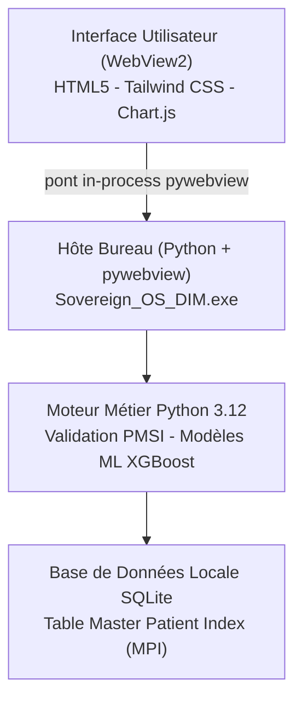
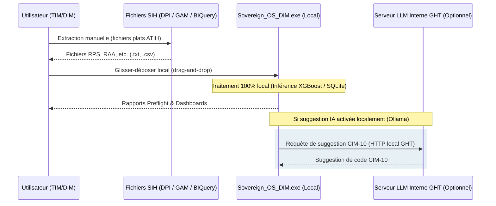

# Dossier de Présentation Fonctionnelle et Technique
### Conformité SI et Sécurité Informatique - Station PMSI
**Projet :** Sovereign OS DIM (V37.4)  
**Date :** synchronisée automatiquement avec la version du projet (`scripts/sync_version.py`)  
**Émetteur :** Apprenti Ingénieur PMSI, Département de l'Information Médicale (DIM)  
**Destinataires :** Direction des Systèmes d'Information (DSI), Département de l'Information Médicale (DIM), Direction des Ressources Numériques (DSN)  
**Établissement :** GHT Psy Sud Paris (GH Paul Guiraud / Fondation Vallée / EPS Erasme)  

---

> **Note de gouvernance et réserve DSN/DSI.** Ce dossier est fourni à la Direction des
> Ressources Numériques (DSN/DSI) préalablement à toute exécution, tout test ou tout
> déploiement, conformément à sa demande d'être associée dès la conception. Les noms de
> modules, l'identité visuelle et l'ergonomie décrits ici sont **provisoires** : ils
> pourront être ajustés ou renommés sur recommandation de la DSN dans le cadre de la mise
> en conformité avec le système d'information et la sécurité de l'établissement. Aucune
> orientation n'est figée ; le présent document sert de base à la revue de sécurité et,
> le cas échéant, à une réunion de cadrage avec la DSN avant test sur environnement isolé.

## 1. Présentation Générale de l'Application

### 1.1 Objectif
Sovereign OS DIM est une solution logicielle d'aide à la décision et de contrôle qualité conçue spécifiquement pour le Département de l'Information Médicale (DIM) du GHT Psy Sud Paris. Elle a pour but de fiabiliser le recueil de l'activité PMSI (notamment en psychiatrie : RPS, RAA, R3A...) avant sa transmission sur la plateforme nationale e-PMSI.

### 1.2 Cas d'Usage Principaux
*   **Identitovigilance (Master Patient Index) :** Détection et résolution locale des collisions d'identité (conflits d'IPP ou de dates de naissance entre différents séjours ou fichiers).
*   **Preflight DRUIDES (15 validateurs métiers) :** Analyse automatisée avant téléversement e-PMSI pour détecter les anomalies de chaînage, doublons, orphelins, codes CIM-10 invalides, ou incohérences de secteur géographique.
*   **Analyse de l'Activité par Unité Médicale (UM) :** Détection automatisée des UM sans activité ("UM dormantes") à partir des fichiers RAA/RPS, facilitant le pilotage médico-économique des pôles de soins.
*   **CimSuggester IA :** Module d'assistance au codage proposant des suggestions de diagnostics CIM-10 en cas d'absence de diagnostic principal (DP) renseigné.
*   **Moulinette FICHCOMP :** Outil local de mise en forme des suppléments FICHCOMP/FICHDMI (transports, médicaments, dispositifs médicaux). Il nettoie un classeur Excel exporté manuellement par l'agent du DIM, puis génère le fichier plat à largeur fixe attendu par l'ATIH et en contrôle la conformité de longueur (53 caractères en médicament, 50 en DMI). Aucune connexion au SIH, traitement de fichiers plats en local uniquement.

### 1.3 Utilisateurs Concernés
L'outil est exclusivement destiné à un usage interne par l'équipe du DIM :
*   Les Techniciens d'Information Médicale (TIM).
*   Les Médecins DIM.
*   Les Chefs de pôle de psychiatrie et de soins (pour la consultation des rapports de structure et d'activité).

---

## 2. Architecture Technique

L'application repose sur un modèle hybride de type application de bureau, combinant la robustesse d'un hôte natif et la flexibilité d'une interface web moderne, s'exécutant intégralement de façon autonome sur la station de travail de l'utilisateur.

L'interface et le moteur métier s'exécutent dans le même processus. La communication
entre la WebView et Python passe par le pont natif de l'hôte (appels de fonctions
in-process), **sans aucun serveur HTTP, sans port en écoute et sans socket réseau**.

### 2.1 Langages et Frameworks
*   **Hôte Bureau :** Écrit en **C# (.NET 8)**. Il gère le cycle de vie de l'application, instancie le composant Microsoft WebView2 (moteur de rendu Chromium) et lance en arrière-plan le service applicatif Python.
*   **Moteur Applicatif (Backend) :** Développé en **Python 3.12**, exposé au frontend uniquement via le **pont in-process de pywebview** (`js_api`), sans framework serveur ni exposition réseau, et empaqueté avec le reste de l'exécutable pour une portabilité totale.
*   **Interface (Frontend) :** Construite en **HTML5 / CSS (Tailwind)** et enrichie par **Chart.js** pour la visualisation des KPI d'activité en temps réel.
*   **Machine Learning :** Modèles d'aide à la décision locaux basés sur **XGBoost** et **LightGBM** (auto-détection du meilleur algorithme) pour la validation des dates de naissance (AUC 0.86), le score de risque de collision MPI (AUC 1.0) et la classification des formats de fichiers ATIH (58 classes, exactitude 0.77).

### 2.2 Mode d'Exécution et Déploiement
*   **Portable et Sans Privilèges :** L'application est fournie sous la forme d'un exécutable unique et autonome (`Sovereign_OS_DIM_Portable.exe`, ou d'un dossier `Sovereign_OS_DIM/` pour un démarrage plus rapide). Elle s'exécute dans l'espace utilisateur standard du système d'exploitation Windows.
*   **Aucune Installation Requise :** L'exécutable n'a pas besoin de droits d'administrateur local ni d'écriture dans le registre Windows (`HKEY_LOCAL_MACHINE`). Elle peut être exécutée directement depuis un dossier de travail utilisateur ou un lecteur réseau.

---

## 3. Stockage et Gestion des Données

Sovereign OS DIM applique les principes de *Privacy by Design* en cantonnant le stockage au strict plan local.

### 3.1 Base de Données
*   **Technologie :** SQLite 3.
*   **Emplacement :** La base de données (`sovereign_os_dim.db`) est stockée localement dans le profil utilisateur Windows de la station de travail (`%APPDATA%` ou le répertoire de l'application).
*   **Contenu :** Elle contient uniquement la table du Master Patient Index (reprise de batch, historique de chaînage IPP/DDN) nécessaire au fonctionnement du moteur de validation et de réconciliation de l'identitovigilance.
*   **Persistance :** Aucune base de données centralisée sur le réseau du GHT ou sur un serveur externe n'est mise en œuvre.

### 3.2 Données Nominatives et Données de Santé
*   L'application traite des données hautement sensibles (IPP, Nom, Prénom, Date de Naissance, diagnostics CIM-10).
*   Ces données sont traitées de manière éphémère en mémoire vive lors du parsing des fichiers ATIH et de l'exécution des règles métiers.
*   Un mécanisme de **pseudonymisation automatique à la volée** est intégré dans le module d'inspection : les identifiants et les données nominatives affichés à l'écran ou exportés dans les rapports d'erreurs techniques sont hachés ou masqués.

---

## 4. Flux Réseau et Intégration au SI Hospitalier

L'architecture réseau de l'application a été conçue pour éviter toute surface d'exposition externe ou interne non contrôlée.

### 4.1 Flux Entrants et Accès aux Données de Production
*   **Aucun Flux Automatique :** L'application ne possède aucune connexion directe (de type JDBC, ODBC ou API REST) avec les bases de données de production du GHT (GAM, DPI, etc.).
*   **Import Manuel :** L'alimentation de l'application se fait exclusivement par import manuel (glisser-déposer dans l'interface) de fichiers plats extraits au préalable par les agents du DIM via les outils décisionnels institutionnels (BIQuery, etc.).

### 4.2 Flux Réseau Externes et Internes
*   **Aucun serveur, aucun port en écoute :** l'application n'ouvre aucune socket et n'expose aucun service HTTP. La communication entre l'interface WebView et le moteur Python se fait exclusivement par appels de fonctions **in-process** (pont natif pywebview), à l'intérieur du même processus. Il n'existe donc aucune surface réseau à interroger, ni en local ni depuis l'extérieur.
*   **Fonctionnement 100 % hors-ligne :** aucun appel extranet ni cloud n'est effectué par défaut.
*   **Module de Suggestion CIM-10 (CimSuggester) :** actif par défaut, mais 100 % local et sans flux réseau - il s'appuie sur un modèle statistique léger entraîné localement (`backend/ml/cim_suggester.py`), embarqué dans l'application. Le nombre de suggestions et le seuil de confiance retenu sont pilotables via `CIM_SUGGEST_TOP_K` et `CIM_SUGGEST_MIN_CONFIDENCE`. Un serveur **Ollama** intranet (variable `OLLAMA_BASE`, optionnelle) peut remplacer ce modèle local ; c'est alors la seule configuration pouvant émettre un flux réseau, purement interne au GHT, ne transportant **aucune donnée nominative patient (IPP, DDN, Nom)**, seulement les libellés cliniques bruts à coder.

---

## 5. Sécurité et Conformité Réglementaire

### 5.1 Absence de Surface Réseau (in-process)
L'application ne comporte **aucune interface de communication réseau**, même locale :
*   Le frontend appelle le backend Python par le **pont in-process** de l'hôte (fonction native `js_api`), à l'intérieur d'un seul et même processus. Aucun serveur HTTP, aucun port, aucune socket n'est ouvert.
*   Il n'existe donc **rien à authentifier ni à interroger** depuis un autre processus ou depuis le réseau : la surface d'attaque et de fuite liée à un service HTTP local est nulle par conception.

### 5.2 Conformité RGPD et Règlements de Santé
*   **Souveraineté des Données :** Aucune donnée de santé à caractère personnel ne sort du poste de travail de l'utilisateur ou du réseau interne sécurisé du GHT.
*   **Conformité avec les Références ATIH et ARS :** L'ensemble des 15 validateurs du preflight DRUIDES est à jour des exigences réglementaires ATIH de la campagne 2026.
*   **Audits de Sécurité Intégrés :** Le code source fait l'objet de scans de sécurité réguliers (outils *Bandit* pour le code Python et *pip-audit* pour la vérification des vulnérabilités connues (CVE) dans les dépendances).

### 5.3 Alignement sur les Référentiels du Système d'Information de Santé
L'application est conçue pour s'inscrire dans les règles applicables à un système d'information hospitalier :
*   **PGSSI-S (Politique Générale de Sécurité des SI de Santé) :** l'outil respecte les principes de moindre privilège (exécution sans droits administrateur), de cloisonnement (traitement local, pas d'accès direct au SIH) et de traçabilité (journal d'audit horodaté).
*   **Secret médical (art. L1110-4 du Code de la santé publique) :** les données de santé restent sur le poste ou le réseau interne du GHT ; aucune divulgation à un tiers non autorisé, pseudonymisation automatique des vues et rapports techniques.
*   **RGPD - données sensibles (art. 9) :** base légale de mission d'intérêt public (contrôle qualité PMSI), minimisation des données, traitement éphémère en mémoire, pas de constitution de base nominative centralisée.
*   **Hébergement de données de santé (HDS) :** non concerné par défaut. Aucune donnée de santé n'est hébergée hors du poste de travail ; il n'y a pas d'hébergement externe ni de sous-traitance de stockage. Toute évolution vers un stockage mutualisé serait soumise à l'exigence HDS et à l'accord préalable de la DSN.
*   **Référentiel Ségur / Identité Nationale de Santé (INS) :** le module d'identitovigilance est compatible avec une montée en qualité INS (contrôle de cohérence des traits d'identité) sans traiter l'INS en production à ce stade.

### 5.4 Engagements vis-à-vis de la DSN avant Mise en Production
Conformément à la demande de la DSN d'être intégrée dès la conception, les étapes suivantes sont proposées avant tout déploiement :
*   **Test en environnement isolé :** la DSN teste l'exécutable sur un poste ou un bac à sable dédié, sans accès aux données de production, avant toute utilisation réelle.
*   **Analyse de risque (méthode EBIOS Risk Manager) :** identification conjointe des scénarios de menace (fuite de fichier plat, exécution de binaire non signé, poste compromis) et des mesures de réduction.
*   **Homologation de sécurité :** l'outil n'est mis en production qu'après avis favorable de la DSN et, si requis, décision d'homologation formelle par l'autorité qualifiée de l'établissement.
*   **Signature de code et distribution maîtrisée :** l'exécutable Windows pourra être signé et distribué par les canaux validés par la DSN (et non de poste à poste), pour garantir son intégrité et sa provenance.

---

## 6. Synthèse pour la DSI
| Critère | Description | Statut |
|---------|-------------|--------|
| **Droit d'administration** | Aucun droit administrateur local requis pour l'exécution. | **Conforme** |
| **Accès réseau extérieur** | Fonctionnement 100 % hors-ligne par défaut. Aucun flux internet requis. | **Conforme** |
| **Accès au SIH** | Pas d'accès direct. Importation manuelle de fichiers exportés par l'utilisateur. | **Sécurisé** |
| **Stockage local** | SQLite 3 stockée dans le profil utilisateur local (`%APPDATA%`). | **Sécurisé** |
| **Identitovigilance** | Résolution et croisement locaux sans exposition. | **Conforme** |
| **RGPD** | Pseudonymisation automatique intégrée pour les vues techniques. | **Conforme** |
| **Secret médical (art. L1110-4 CSP)** | Données de santé cantonnées au poste / réseau interne, aucune divulgation externe. | **Conforme** |
| **PGSSI-S** | Moindre privilège, cloisonnement, journal d'audit horodaté. | **Conforme** |
| **Hébergement HDS** | Aucun hébergement externe de données de santé. Non concerné par défaut. | **Non concerné** |
| **Homologation de sécurité** | Test en environnement isolé + avis DSN requis avant mise en production. | **À valider (DSN)** |
